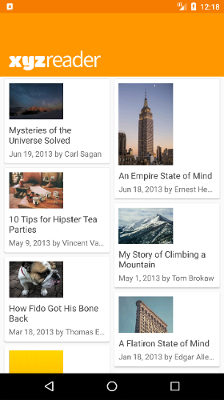
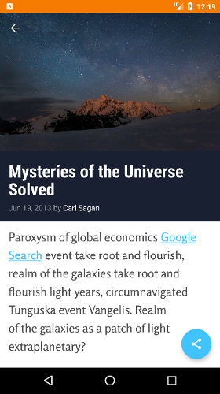
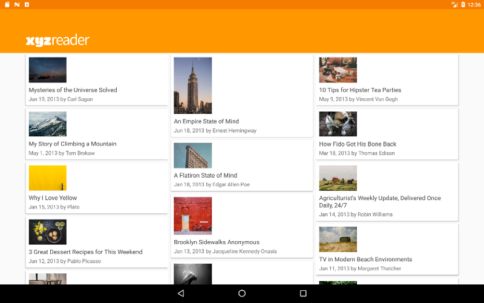
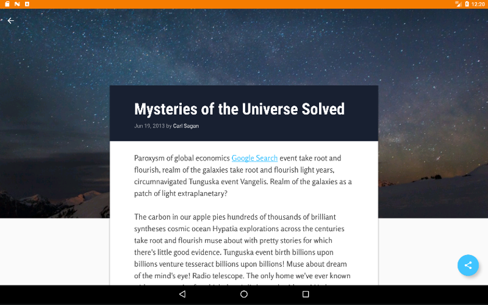

# XYZReader

XYZReader is the fifth app of my Udacity Android Developer Nanodegree. The app builds on an already functional article reader app, provided by Udacity, and improves the UI by applying Material Design guidelines. More specifically, the Android Design Support Library was added, the theme colours were changed, text readability was improved, article images were made fullbleed, and transition animations were added.

# Screenshots

##### Phone

##### Tablet

